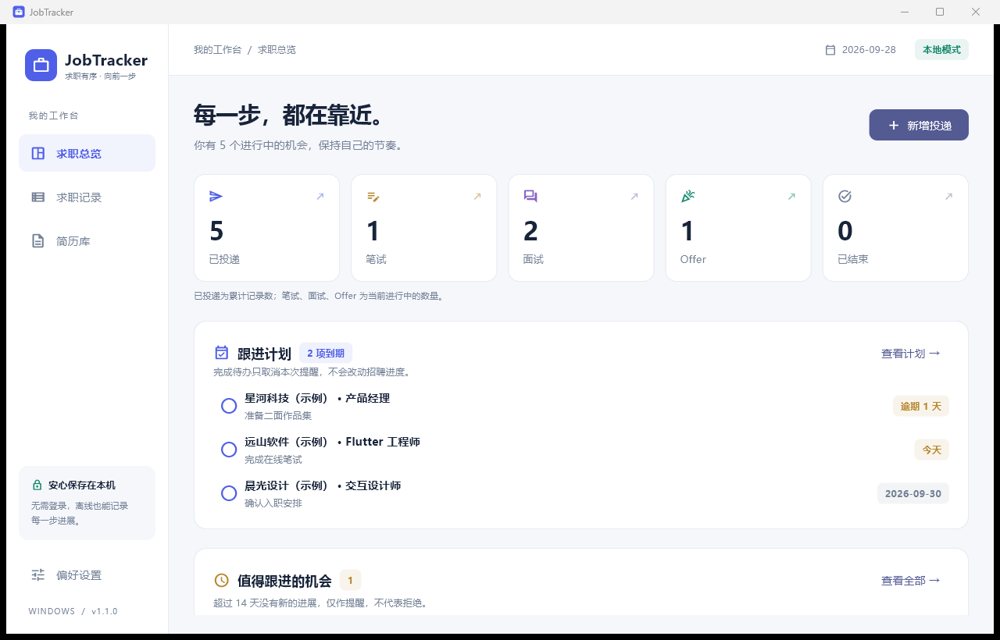

# JobTracker · 求职有序

中文 Windows 求职管理应用。Flutter + SQLite，完全本地保存，无需账号、服务器或订阅。

## 下载与运行

在 [GitHub Releases](https://github.com/XDUgzh/jobtracker/releases/latest) 下载 Windows x64 ZIP，完整解压后双击 `jobtracker.exe`。

**请保留整个文件夹**，包含 DLL 和 `data/`，不能只复制 EXE。适用于 Windows 10/11 x64；发布包附带 Visual C++ 运行库，使用时无需 Flutter 或 Visual Studio。

## 功能

- **求职总览**：累计投递、当前笔试、面试、Offer、已结束统计，最近进展和待跟进提醒。
- **求职记录**：公司、岗位、日期、阶段、状态、来源、岗位链接、备注、关联简历；支持增删改、搜索、筛选、排序。
- **求职时间轴**：手动记录真实招聘进展或跟进备注，补录旧事件不会覆盖新进度。
- **简历库**：导入 PDF / DOC / DOCX，管理名称和版本，保留本地副本并关联投递。
- **跟进计划（v1.1）**：设置下次跟进日期与下一步行动，首页显示今天/逾期待办；完成待办不会改变招聘进度。
- **重点收藏（v1.1）**：在表单或详情页收藏机会，列表点击公司图标切换收藏，可筛选重点机会。
- **CSV 导出（v1.1）**：列表右上角下载按钮或偏好设置可导出全部记录，Excel 可直接打开中文内容。
- **一键备份恢复（v1.1）**：包含记录、事件、设置与全部已登记简历副本；恢复前验证，并自动保存恢复前备份。
- **长期无响应**：默认 14 天，可调整为 7/14/21/30/60 天；只作提醒，不会自动判为拒绝。



## 使用建议

1. 先在“简历库”导入简历，然后在新增投递时关联具体版本。
2. 将重要机会收藏；设置“下次跟进”和“下一步”，例如准备二面或询问结果。
3. 收到招聘反馈时添加事件；仅主动询问但没有新消息时，关闭“收到新的招聘进展”。
4. 定期在“偏好设置”点击“备份全部数据”，保存 `.jobtracker` 文件。

## 统计和日期规则

“已投递”统计全部未删除的记录。“笔试 / 面试 / Offer”统计当前该阶段且仍在进行中的记录。“已结束”包括明确拒绝、主动放弃和已入职。

阶段与状态独立。创建记录生成初始事件，编辑阶段或状态追加今天的事件；其他字段变化不重置等待天数。实际进展按日期倒序，同日以最后录入为准。事件不得早于投递日或晚于今天，投递日不能改到已有事件之后。

等待天数按本地日历日期计算。进行中且非 Offer 的记录达到阈值显示“长期无响应”。跟进计划独立计算：进行中记录（包括 Offer）到期会提醒，已结束记录不提醒。两类提醒都不会自动修改状态。提醒仅在应用内显示，未运行时不发系统通知。

## 数据、升级和恢复

默认用户数据：`%LOCALAPPDATA%\JobTracker\data`。偏好设置可打开实际目录。

- `jobtracker.sqlite3`：记录、事件、简历元数据及设置。
- `resumes/`：简历本地副本，以相对路径引用，可以随完整数据目录迁移。
- `backups/`：恢复操作前自动生成的 `.jobtracker` 备份。
- SQLite 运行时可能有 `-wal / -shm` 工作文件。

新版首次打开会将旧数据库从 schema v1 升级到 v2，保留原记录。升级前退出旧版，保留数据目录，再运行新版。升级后不要再用 v1.0 打开同一数据库。

### 一键备份

无需退出应用；导出单个 `.jobtracker` 文件，包含已登记简历的副本。文件包含个人求职信息，请按自己的需要保存。当前限制为 100 MB；更大数据量请退出应用后复制整个数据目录。若已登记的简历副本缺失，会提示错误而不会生成不完整备份。

### 从备份恢复

选择备份并确认后，应用验证内容，再替换当前全部数据。无效备份不会改变现有记录；恢复前的数据自动保存在 `backups/`，可再次选择该文件回退。旧简历副本保留，避免误删；原文件始终不会被修改。

CSV 只用于分析或共享，不包含简历文件和完整事件历史，不能代替备份。导出使用 UTF-8 BOM、标准引号及表格公式前缀防护。

也可以退出应用后完整复制数据目录备份；恢复前另存当前目录。`JOBTRACKER_DATA_DIR` 环境变量可指定独立目录，适合演示或测试。

## 开发、测试与构建

已验证 Flutter stable **3.47.5** / Dart **3.13.4**，Visual Studio 2022、C++ 桌面开发组件、Windows SDK 10.0.26100.0。

开发需要 Flutter stable、Git、Visual Studio“使用 C++ 的桌面开发”（MSVC、Windows SDK、CMake）。推荐启用 Windows 开发者模式；项目脚本在缺少符号链接权限时支持目录连接回退，不修改系统设置。只开发 Windows，无需 Android/iOS 工具链。

```powershell
# 在仓库根目录：准备依赖并运行
powershell -ExecutionPolicy Bypass -File .\scripts\run.ps1

# 静态检查、单元和界面测试
flutter analyze
flutter test

# 在真实 Windows 窗口运行端到端测试
flutter test integration_test\app_test.dart -d windows

# 构建并收集运行库与使用说明
powershell -ExecutionPolicy Bypass -File .\scripts\build.ps1
```

脚本默认发布目录：`dist/JobTracker-Windows-x64`。原始构建命令为 `flutter build windows --release`，产物位于 `build/windows/x64/runner/Release/`。首次下载开发依赖需要网络，成品离线可用。

GitHub Actions 会在推送或 PR 时执行 Windows 静态检查、测试和 Release 构建，构建目录可在对应工作流的 Artifacts 下载。

本机开发环境补充：安装路径 `%LOCALAPPDATA%\JobTrackerDev\flutter` 已加入用户 PATH；新终端生效。依赖缓存由用户级 `PUB_CACHE` 指定，脚本会读取该设置。

## 仓库结构

```text
lib/
  main.dart              启动与本地数据目录
  app.dart               工作台与操作协调
  data/models.dart       领域模型、提醒规则
  data/database.dart     SQLite、迁移与简历持久化
  data/transfer.dart     CSV、备份验证与事务恢复
  ui/                    总览、记录、时间轴、表单、跟进计划
windows/                 Windows 原生窗口与图标
scripts/                 依赖准备、运行、构建脚本
test/                    数据规则、迁移、备份恢复、界面测试
integration_test/        真实 Windows 窗口端到端测试
.github/workflows/       Windows 自动检查和构建
docs/                    设计说明、使用说明、验证记录
```

源码与 `pubspec.lock` 进入 Git；用户数据库、简历副本、导出备份、CSV、构建产物均不进入仓库。

## 当前边界

招聘进度需要手动录入，不读取邮箱、不抓取招聘网站、不云同步。简历由系统默认 PDF/Office 软件打开。数据库和备份未加密，使用本机账户文件权限保护。发布包为便携目录，未进行代码签名，尚未提供自动更新或安装向导。
